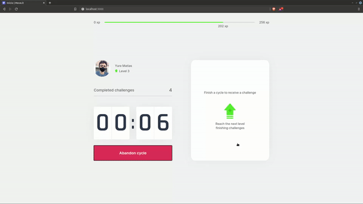

# 🏅Move-it🏃 

A React and Next.js app with exercise challenges in the Pomodoro style. Developed during the Next Level Week 4 from @Rocketseat

Visit the <a href="https://moveit-dev.netlify.app/">Demo Website</a> 🚀

## Technologies applied 

- React
- React Context API
- Next.js
- Cookies
- Audio Web API
- Notification API

## Interface



 
## Installing

```bash
npm install
# or
yarn
```

## Running

```bash
npm run dev
# or
yarn dev
```

Open [http://localhost:3000](http://localhost:3000) with your browser to see the result.
